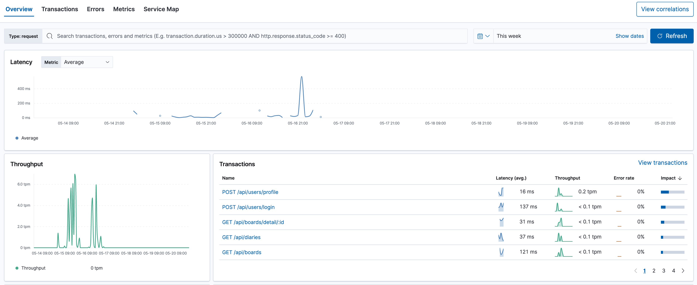

# EEUM Backend
* * *
서비스 주소: http://kdt-ai6-team02.elicecoding.com/

swagger 문서 주소: http://kdt-ai6-team02.elicecoding.com/backend-docs
> Swagger 접속 시 username에는 **brian**, password에는 **hyosang** 을 입력하시면 됩니다

## 일기를 작성하고 야식을 추천받아봐요!

## 팀 구성 (백엔드)
- 김도엽 (백엔드 팀장)
- 곽희웅
- 윤지희 (서포트 레이서)

## EEUM 백엔드는 어떤걸 사용했을까요?

### 언어

### 프레임워크

### 데이터베이스

### ORM

### 메시지 큐

### 배포

### 운영

## 주요 기능

- 일기 작성 시 SQS를 이용한 **Pub/Sub** 구조로 감정 분석 수행
- 키워드를 통한 게시글 검색 기능 (MySQL의 Full-Text Index 활용)
- 감정분석 결과를 통한 야식 추천 기능
- 게시글 CRUD 및 게시글에 댓글 추가, 수정, 삭제 기능

## 개발 이슈

### 게시글 검색 기능 구현
게시글 검색은 제일 간단하게는 Like 연산을 통해서 수행하는 방법이 있으나, Like 연산은 복잡도가 매우 높고, 테이블에 레코드가 많으면 많을 수록 그에 비례해 
성능이 엄청 깎이는 현상이 있다.

이러한 문제를 해결하기 위해 MySQL의 Full-Text Index를 활용하기로 결정하였음.

하지만 MySQL의 Full-Text Index는 문장을 단어 단위로 토큰화 해서 별도의 자료구조로 저장하는 특성이 있는데, **단어의 길이가 3 이상인 경우만 자료구조에 등록된다는 
특징이 있다.** 2글자부터 검색이 가능하도록 기능을 개선하기 위해 MySQL의 값을 튜닝하였다.

> **innodb_ft_min_token_size=2**

InnoDB 엔진 기반으로 동작하는 모든 테이블의 Full-Text Index의 토큰 사이즈를 최소 3에서 2로 수정하여 문제를 해결하였다.

### 일기를 Flask 서버에 어떻게 전달할것인가?
대부분의 비지니스 로직은 모두 NestJS로 처리하고, AI 서버는 Flask로 구현하여 모델을 운영하고있다.

그렇기 때문에 일기 작성 엔드포인트는 NestJS 서버에 위치한 상황인데, 문제는 작성하고 어떻게 분석을 수행할 것인가에 있었다. (즉, 일기 작성 시 Flask 서버가 이를 캐치해야함)

이를 해결하기 위한 방법은 크게 아래의 3가지 방법을 고려해보았다

1. Redisson 등의 Redis pub/sub 라이브러리를 활용하여 일기 메시지를 발행하여 처리한다
2. Cron Job을 하나 정의해서 Flask 서버에서 정기적으로 일기 목록을 전부 조회하고, 분석이 안된 일기에 대해서 분석을 수행한다
3. 낯설더라도 Amazon SQS를 이용해서 메시지큐 기반의 pub/sub으로 문제를 해결한다

2번의 경우에는 구현이 제일 간단하지만 주기적으로 일기 목록을 전부 조회해야하기 때문에 오버헤드가 상당히 큰 방법이라서 배제하였다.

1번의 경우에는 **Redis** 라는 관리포인트가 발생하기 때문에, 그리고 Redisson 이라는 별도의 라이브러리를 학습해야하는 특징 때문에 배제하였다.
(저거 하나 해결하자고 Redis를 학습하고, Redisson을 학습할 필요는 없다고 판단하였음)

결국, 3번의 방법으로 해결하였는데, 크게 이유는 2가지이다.

1. Amazon SQS는 AWS에서 제공하는 매니지드 메시지 큐 이기 때문에 관리에 공수가 들어가지 않는다
2. Amazon SQS의 큐 타입을 FIFO Queue로 설정하면 메시지가 **정확히 한번** 처리될 수 있다. 하지만 이러한 특징이 병목 포인트를 유발할 가능성은 염두해야한다

### Validator 객체에서 Business Exception을 발생시키면 4xx 에러가 아닌 5xx 에러가 발생하는 현상
class-validator를 통한 검증 외에 별도의 비지니스적인 검증이 필요할 경우 본 프로젝트에서는 Application Layer에 Validator 계층을 놓고 검증 책임을 두고있다.

따라서 Validator 객체에서 검증 실패 시에 에러를 발생시켜야한다고 생각했지만, Controller에 적용된 Filter를 무시하고 **HttpExceptionFilter**를 타지 않고 계속 **AllExceptionsFilter**를
타고있는 현상이 관측되었다.

~~~Typescript
/* user.controller.ts */
@UseFilters(HttpExceptionFilter)
@UseInterceptors(ApmInterceptor) // for elastic apm
@Controller()
export class UserController {
  constructor(private readonly userService: UserService) {}

  ...
}

// main.ts
app.useGlobalFilters(AllExceptionsFilter)
~~~

이러한 현상을 해결하기 위해 Validator에서 검증 오류가 발생 시에 실패를 기록한 ValidationResult를 early-return 시키고, 
검증 로직을 모두 통과할 시에는 성공을 기록한 ValidationResult를 리턴시키는 방식으로 구현하였다.

### Build 서버의 디스크 용량 부족에 의해 Jenkins build가 깨지는 현상
본 프로젝트는 Develop 브랜치에 머지 혹은 푸쉬 이벤트가 발생하면 Jenkins가 웹훅을 통해서 빌드를 하고 배포를 하는 방식의 자동배포가 적용되어있다.

그리고 빌드 서버의 HDD는 30GB 정도로 매우 넉넉하게(?) 용량을 잡아둔 상태인데, 어느 순간 아래의 에러가 Jenkins 빌드서버의 로그로 남아있었다.

~~~bash
No space left on this device
~~~

사실 이 에러는 NestJS 서버 빌드 과정이 아닌, Flask 서버 빌드 과정에서 발생하였는데, 원인은 아래와 같았다.

1. Flask 서버 빌드 과정에서 pip install을 거치는데, 이 과정에서 pip 의존성을 cache 디렉토리에 보관하고있었다. 이로 인해서 도커 이미지 용량이 커졌다.
~~~Dockerfile
RUN pip install --cache-dir=./pip-cache -r ./requirements.txt
~~~
2. 도커 이미지의 용량도 용량이지만, 제일 큰 문제는, Docker는 빌드 과정에서 레이어별로 빌드 캐시를 시스템에 남겨두는데, 이 빌드 캐시 용량 자체도 엄청 크다는 것이다. 
그리고 이러한 빌드 캐시는 빌드 별로 따로 쌓이기 때문에 디스크에 가용 용량은 기하급수적으로 줄어든다.

이를 해결하기 위한 방법은 아래와 같았다.
1. 빌드 서버는 Docker build 이후에 이미지를 재사용하지 않는다. 따라서 아래의 커맨드로 사용하지 않는 이미지는 정리한다
~~~bash
docker image prune
~~~
2. 이미지만 지운다고 해서 시스템에 쌓인 빌드 캐시가 없어지지는 않는다. 하지만 빌드 서버는 빌드만 책임질 뿐, 그 외의 책임은 존재하지 않기 때문에 아래의 커맨드를 이용해서 docker system을 정리한다
~~~bash
docker system prune
~~~

### .env 파일의 동적 주입
.env에는 보통 민감한 정보가 들어가기 때문에 **.gitignore** 파일을 이용해서 git에 올라가지 않도록 설정해둔다.

하지만 Jenkins는 매번 새로운 git clone을 수행하기 때문에 빌드 과정에서 .env는 존재하지 않는다. 따라서 Jenkins 빌드 과정에서 .env를 어떻게든 주입해야한다.

고려한 방법은 아래의 두 가지이다.

1. Jenkins Credential에는 파일을 비밀스럽게 관리하는 기능이 있다. 이를 이용해서 .env를 관리한다
2. S3에 저장한다. 그리고 Jenkins 빌드 과정에서 S3로부터 다운로드 받아서 빌드한다

이 중에서 2번째 방법을 채택하였는데, 1번 방법의 경우에는 .env 파일의 변경이 잦은 경우 관리가 매우 불편한 점이 있다. 따라서 S3에 업로드하고, 다운로드 하는 방식을 채택하였다.
